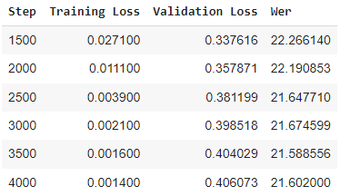
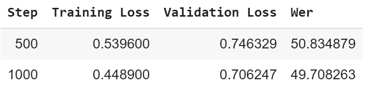
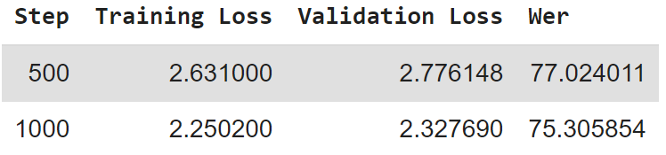

# Lab 2

Scalabale Machine Learning (ID2223)
By Tobias Lord and Jacob Dahlkvist (group 19)

## Introduction

In September 2022 authors Alec Radford et al. released Whisper, a pre-trained model for speech recognition (ASR). Whisper is trained on labeled audo-transcription data. Since a big part of the data its been trained on is multilingual ASR data, results on the data can be used in many langugages.

## Purpose

The purpose of this lab is to demonstrate the capabilities of Whisper using the mother tongue of the authors, in this case Swedish. First, we will follow the [given sample code](https://colab.research.google.com/github/sanchit-gandhi/notebooks/blob/main/fine_tune_whisper.ipynb) and then make some additions to it.

- Refactor the code into
  - Feature engineering pipeline which can leverage a CPU
  - Training pipeline which makes use of an GPU
  - Inference program to display the model's capabilities
- Ponder and possibly show how we can improve results using
  - a model-centric approach (e.g., tune hyperparameters, change the fine-tuning model architecture, etc)
  - a data-centric approach - identify new data sources that enable you to train a better model that one provided in the blog post

## Implementation

### Whisper (Small in Swedish)

The first implementation was completely based on the blog, referred earlier, with some minor changes:

- Swedish instead of Hindi
- Save checkpoint each 500 steps
- Evaluation steps to 500

In the first attempt it wasn't possible to get a GPU in Google Colab, so we tried with a CPU. However, we learned the hard way that the training of the model would take a long time (>100h) using a CPU. Therefore we restarted, with a GPU this time. The training of the model took about 10 hours, we had to restart once from step 1 000 (of 4 000). We also decreased the steps between each evaluation to 500 (from 1 000) which increased the time.

#### Result

As can be seen, from the recorded WER (Word Error Rate), the results were decent considering using the small dataset. The WER started at a reasonably good level, 22.266, after 1 500 steps. The final result after 4 000 steps were 21.602, not that much lower. This shows that the tradeoff between time finetuning the model and the actual result is quite small. Since the validation loss is a lot greater than the training loss, it indicates that our model might be overfitted. [See this notebook for reference](Fine_tune_whisper_ID2223.ipynb)

### Refactoring into pipelines

To refactor into pipelines we created a new notebook in Google Colab. The reason why we used Colab instead of Modal or something else was mostly because of convience. It would make more sense to create actual Python scripts if this was a more realistic setting, Colab is not built for long-running calculation (since you need to remain active etc.) and you cannot schedule the updates of the models and so on.

We basically divided the code into two parts, the CPU part and the GPU part. The creation of the dataset that we trained our model on was done using an CPU, we then saved the pre-processed dataset on Google Drive. In the beginning of the GPU part we fetch the dataset from Google Drive and can then proceed to train the model. We also saved checkpoints of the model training on Google Drive.

#### Result

[See this notebook for reference](WhisperPipeline.ipynb)

### Suggestion of improvements

#### Model-centric approach

First off, it is important to make the learning rate smaller than it was during the original training, since we want to dive deeper into the details. Hyperparameter tuning can be utilized to optimize the WER. The trick is to find the best possible combination of the hyperparameters. It is possible to do it manual but can also be made automatic. One automatic method of choosing hyperparameters is grid search, which tries every single combination of hyperparameter possible. However, this method is computationally costly and may not always be feasible. Another method is random search which will not test all combinations, but only a certain number of combinations chosen randomly. It is no guarantee that it will yield the best possible combination but is often much less computational expensive. One can also use Bayesian regression model to estimate the expected value of the validation set error for each hyperparameter and the uncertainty around this expectation. However, this will not yield a better result with certainty since it is not yet a established tool. Another approach is to try to debug the algorithm. A poor execution may be the results of a bug in the algorithm. An example of doing this may be to investigate the output and look for errors. A model can also be fine-tuned using ensemble methods, i.e. combining models that works best.

#### Data-centric approach

First off you can drop features that are not relevant. Using a bigger dataset could also improve the results of the model. By finding datasets containing audios of people with various accents could also improve the model. If datasets used are filled with audios of a person with a certain accent the model may be a bit overfitted since it is adjusted to that kind of accent.

#### Implementation

To see whether our results would improve by a smaller learning rate we used the whisper-tiny dataset (because of computation / time constraint) and finetuned the model with 1 000 steps, first with a learning rate of 0.00001 (1e-5) and then 0.000001 (1e-7) to see whether we could reach a lower WER.

##### Result

The result is significantly worse than using the larger dataset, which is to be expected since we use fewer steps and have less data.

Decreasing the learning rate was apparently not good at all. However, it makes sense when we consider the other parameters. Since we decreased the learning rate, we also increased the number of steps required for each epoch. Therefore, the results are not comparable since the second try did not do as many epochs. To further dig into this, we would need to have the same number of epochs.

### Inference

To showcase our model trained on whisper-small, we created an Gradio application which uses the trained model to transcribe the text and then uses the Google Translate API (using the DeepTranslator module) to translate the text. We used a chat interface in Gradio to show both the transcription and the translation. We give the user possibility to both test it on a YouTube video and record its voice.

#### Result

See this Hugging Face [space](https://huggingface.co/spaces/tlord/whisper-easy-demo)
